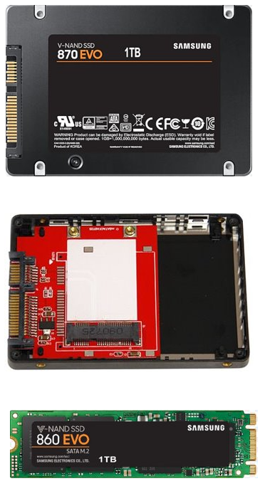
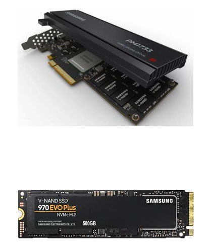
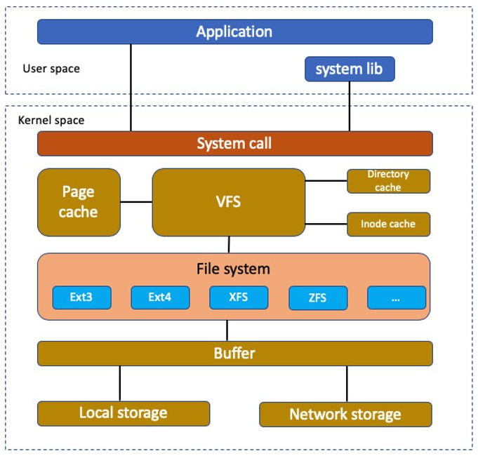
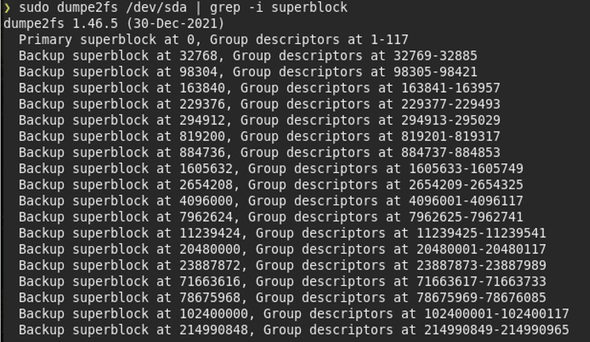
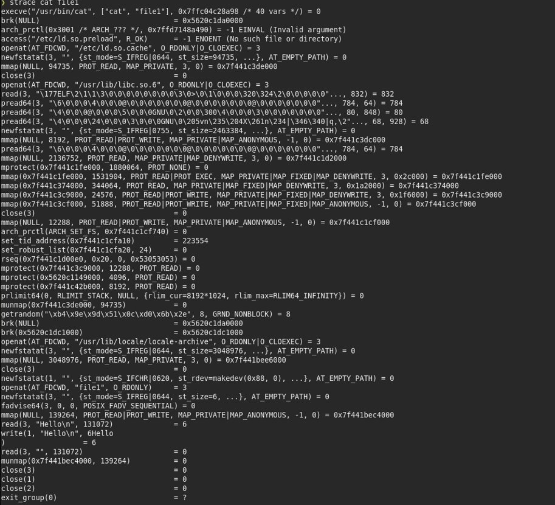

# Storage

    Course Code: ELEE1119 
    
    Course Name: Advanced Computer Engineering

    Credits: 30

    Module Leader: Seb Blair BEng(H) PGCAP MIET MIHEEM FHEA

---

## Storage Types

**SSD**: don’t rely on magnets and disks, instead they use a type of flash memory called NAND. In an SSD, semiconductors store information by changing the electrical current of circuits contained within the drive. This means that unlike HDDs, SSDs don’t require moving parts to operate.​

**HDD**: Use magnetic technology to store data and has been around since the 1950. A hard disk drive is comprised of a stack of spinning metal disks known as platters. Each spinning disk has trillions of tiny fragments that can be magnetised in order to represent bits (1s and 0s in binary code).​

---

## Storage Types

**Optical Storage**: CD can store up to 700 MB of data, DVD-DL can store up to 8.5 GB, and Blu-Ray can store between 25 and 128 GB of data.​

**Flash Memory**: A flash memory device contains trillions of interconnected flash memory cells that store data. These cells hold millions of transistors that when switched on or off represent 1s and 0s in binary code, allowing a computer to read and write information.  Currently can store 2 TB of data.​

---
## Types of SSD
- Serial Advanced Technology Attachment (SATA)

- Mini SATA

- SATA M.2



---

## Types of SSD

- Periphal Component Interconnect Express M.2 (PCIE)

- Nov-Volatile Memory Express M.2 (NVME)
- 


---

## Comparison

||NVME SSD| M.2 SSD| SATA SSD|
|---|---|---|---|
|Speed|PCIE Gen 3 < = 3.5GB/s PCIE Gen 4 <= 7.5GB/s| <= 550MB/s| <= 550MB/s|
|Form Factor|M.2, U.2, PCIE| M.2| 2.5" M.2|
|Interface Types|NVME|SATA, NVME|SATA|
|Adv| High Speeds|Little physical space|Good balance between affordability and speed|
|Dis-Adv|High Costs|More expensive 2.5"| Slower speeds|

---

## Data Rates

T2T  = Time to Transfer
A$_d$  = Amount of data
T$_s$  = Transfer speed

$$
    \begin{aligned}
     T$_s$ &= \frac{A$_d$}{T2T}
    \end{aligned}
$$


$$
    \begin{aligned}
     28.57MBps &= \frac{1\cdotA 10$^6$(GB)}{35s}
    \end{aligned}
$$

T2T = 86.68s
A$_d$ 134GB

$$
    \begin{aligned}
     1546MBps &= \frac{134\cdot 10$_6$GB}{86.68s}
    \end{aligned}
$$

---

## PCIE Gen \#

- 2.0 - 8b/10b encoding. ​
- 3.0 - 128b​
- 4.0 - 130b encoding technique

4.0's 2 extra bits allows for reasonable clock recovery (extracting timing information from the datastream) and ensures alignment of the datastream. 16GT/s (gigatransfers) which means the maximum theoretical bandwith of PCIe 4.0 is:​ 

15.754Gb$^{-s}$ and 1.54% overhead.

​

---

# File Systems

---

## Linux File System Structure




The file system requires an API to access the function calls to interact with file system components like files and directories. 

The first two parts of the given file system are called a **Linux virtual file system**. It provides a single set of commands for the kernel and developers to access the file system. This virtual file system requires the specific system driver to give an interface to the file system.​

<!--Application Programming Interface-->


---

## Types of Linux File Systems


---

## File Systems

- **New Technology File System** - NTFS partitions can extend up to 16EiB​
Primarily used for Windows and Linux systems. Can't natively write to partition in MAC OS as it lacks the drives. However, third party tools can provide a way to do this.​

- **File Allocation Table** - FAT is a general purpose file system that is compatible with Windows, Linux/Unix and MAC OS. Windows can't deal with anything greater than 32GB or FAT32. FAT suffers from over-fragmentation, file corruption, and limits to file names and size.​

---
## File Systems

- **Extended File Allocation Table** - exFAT is a Microsoft file system with compatibility with MAC OS 10.6+. Used in TVs and portable media players. Can be 512TBs in size. Doesn't work with Linux /Unix. Suffers from defragmentation and cannot pre-allocate disk space.​

- **Hierarchical File System** - Built by Apple for MAC OS X. 8EiBs. Drivers are available for Linux systems to read and write to HFS+​

---

## File Systems

- **Extended File System** - EXT4, was created for Linux Kernels. Can be up to 1 EiB a file can be 16 TB. EXT4 is backward compatible with version 2 and 3. EXT4 can pre-allocated disk space. By default Windows and MAC OS cannon read EXT.​

- **Journal File System** - A high-performance journaling file system, was first developed by Silicon Graphics for the IRIX operating system in 1993. It is the default file system for IRIX version 5.3 and then it was later ported to the Linux kernel.​

---

## File Systems 

- **B-Tree File System** - Btrfs (b-tree fs), was created to address the lack of pooling, snapshots, checksums, and integrated multi-device spanning in Linux file systems, particularly as the need for such features emerged when working at the petabyte scale. ​

- **Zettabyte File System** - Merges the traditional volume management and filesystem layers, and it uses a copy-on-write transactional mechanism—both of these mean the system is very structurally different than conventional filesystems and RAID arrays​

---
## Small Computer System Interface Disk (scsi)

 - The first hard disk detected on the SATA by the Linux port, system carries the label sda (sd => scsi disk)​

- The second would be sdb​

- nvme0n1 means first disk detected on the nvme port​


---

## Universally Unique Identifier

International Telecommunication Union (ITU) **ITU-T X.667 | ISO/IEC 9834-8**​

UUIDs are an octet string of 16 octets (128 bits) in a 8-4-4-4-12 format​:
- Hex: f81d4fae-7dec-11d0-a765-00a0c91e6bf6 ​
- Dec: 329800735698586629295641978511506172918​

Five versions:​
- UUID1 = Timebased + Unique or MAC [no repeats till 3603AD]​

- UUID2 = Timebased(LSB) + userid​

- UUID3 = Namespace+MD5 hash​

- UUID4 = PRNG [1 trillion UUIDs for a chance of 2 repeats]​

- UUID5 = Namespace + SHA-1 hash​

---

## UUID​4 Example

1. Generate 128 random bits:
   
   <div align=center>

    00000101 01100111 11010110 00011100 00101110 11100011 **10110010** 00111001 **00010100** 00010100 00010001 00010000 00100101 01101101 00100011 10000101 

    </div
    
2. Take the 7th byte and perform an AND operation with `0x0F` to clear out the high nibble. Then, OR it with `0x40` to set the version number to 4.

<div align=center>

00000010  = **10110010** & 00001111​

10000010  = **00000010** |  10000000

</div>

---

## UUID4 Example 

3. Next, take the 9th byte and perform an AND operation with `0x3F` and then OR it with `0x80`.

<div align=center>
00010100  = **00010100** & 00111111​

10010100  = **00010100** |  10000000

</div>

4. Convert the 128 bits to hexadecimal representation and insert the hyphens to achieve the canonical text representation.​

<div align=center>

567D61C2-EE30-2399-4141-110256D2385​

</div>

---

## Your Turn

<div align=center>

10101110 00100001 10110100 11111100 01101111 01110010 **10100011** 00110010 **10111010** 10000110 11010010 00001001 11010001 11100000 10101111 01101001 ​

</div>​

2. Take the 7th byte and perform an AND operation with `0x0F` to clear out the high nibble. Then, OR it with `0x40` to set the version number to 4.​

3. Next, take the 9th byte and perform an AND operation with `0x3F` and then OR it with `0x80`.​

4. Convert the 128 bits to hexadecimal representation and insert the hyphens to achieve the canonical text representation.​

<details>
<summary>Answer</summary>

AE21B4FC-6F72-4332-7A86-D209D1E0AF69​

</details>

---

## Everything is a File...

**Inodes**
- It is used to record the metadata of the file, such as the inode number, file size, access rights, modification date, data location, etc. One file has one associated inode, and like file content, inode stores on disk.

**Directories**
- D(d)entry for short, is used to record the name of the file, the inode pointer, and the association with other directory entries. ​

- Multiple associated directory entries constitute the directory structure of the file system. ​

- However, unlike inodes, a directory entry is an in-memory data structure maintained by the kernel, so it is often called a directory entry cache.​

---

## Superblock Information



---

## File, Inode, Address_Space


```c
struct address_space_operations{​
    int (*writepage)(struct page *page, struct writeback_control *wbc);​
    int (*readpage)(struct file *, struct page *);​
    /* write back some dirty pages from this mapping */​
    int (*writepages)(struct address_space *, struct writebackcontrol *);​
    /* set a page dirty. Return true if this dirited it */​
    int (*set_page_dirty)(stuct page *page)​
    int (*readpages)(struct, file *filp, struct address_space *mapping, ​
                                struct list_head *pages, unsigned nr_pages);​
    …​
}​
```
---

## Strace

Tracing system calls and signals

