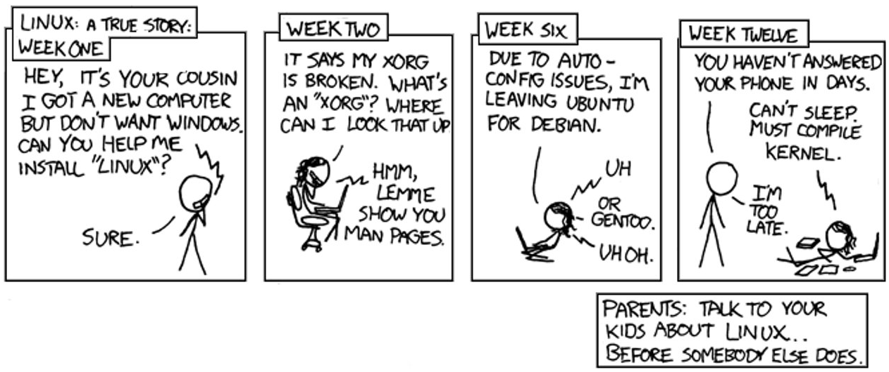
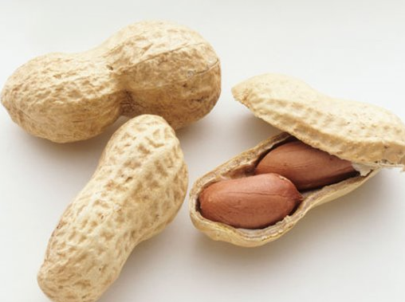

# Kernels and Operating Systems - Linux

    Course Code: ELEE1119 
    
    Course Name: Advanced Computer Engineering

    Credits: 30

    Module Leader: Seb Blair BEng(H) PGCAP MIET MIHEEM FHEA

---

## What is Linux?

---

## Linux is...

- a kernel developed by Linus Torvald in the 1994 
- it's Free and Open-Source
- monolithic
- modular
- currently at version 5.19 in development

---

## Linux Kernel

|**Six Major Functions**| **Six Layers** |
|-----------------------|----------------|
|  System               | Userspace Interfaces    |
| Processing            | Virtual |
| Memory                | Brdiges |
| Storage               | Functional |             
| Networking            | Devices Control |
| Human interface       |Hardware Interfaces |

<!--https://upload.wikimedia.org/wikipedia/commons/5/5b/Linux_kernel_map.png-->

---

## Kernel is...

If implemented properly the Kernel is invisible to the user, working in its own little world known as the **Kernel Space**. Like where it allocates memory and track of where everything is stored. The **User Space** is the files or applications, what the user sees!

The Kernel is **software​**

---

##

---