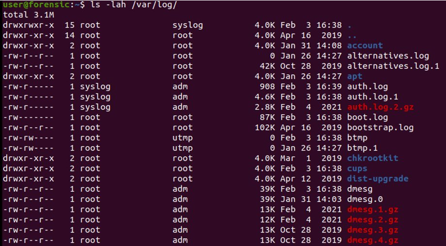
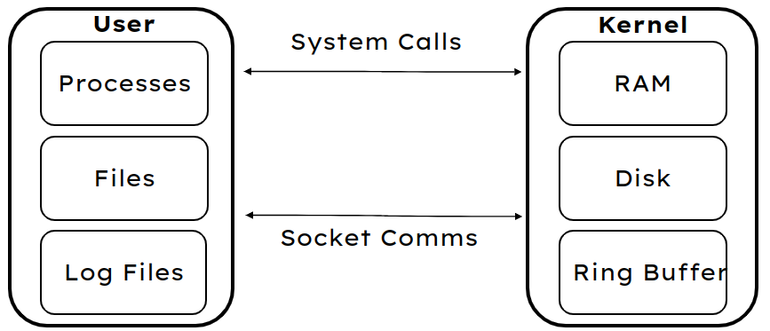

# Logging and Log Rotation

    Course Code: ELEE1119 
    
    Course Name: Advanced Computer Engineering

    Credits: 30

    Module Leader: Seb Blair BEng(H) PGCAP MIET MIHEEM FHEA

---

## Why do we log?

Logging is the process of recording application actions and state to a secondary interface.​

Gives you a visual history of everything that’s been happening in the heart of an operating system for example, this my Linux system.​


---

## GZIP Version of the Lecture

The location and format of your Linux system logs **depend on how your distro is configured**.​

**Most distros have systemd**. It means all your system **logs live in the journal**. To view and search it, **use journalctl** command.​

**Some distros get system logs to syslog**. Either directly or through the journal. In this case, you likely have logs written to various files in `/var/log`. 

---

## What are linux logs

Linux logs are pieces of data that Linux writes, related to what the server, kernel, services, and applications running on it are doing, with an associated timestamp. ​

They often come with other structured data, such as a hostname, being a valuable analysis  and troubleshooting tool for admins when they encounter performance issues. 


One of my pis at home that monitors the external and internal environment I am using a serilog which is for .NET​

---

## Var Log example



---

## Logging Types

**Kernel logging**: related to errors, warning or information entries that your kernel may write;​

**User logging**: linked to the user space, those log entries are related to processes or services that may run on the host machine.​
​


---

## Standards

There are several best practices offered by leaders and established institution on logging and monitoring ​

- National Institute of Standards and Technology (NIST) from their Information Technology Laboratory at the Computer Security Resource Centre 
  - SP 800-92 Guide to Computer Security Log Management​

- International Organization for Standardization (ISO) 27000 series – Information Security Management ​
  - ISO 27001 Annex : A.12.4 Logging and Monitoring​

- Internet Engineering Taskforce (IETF)​
  - The syslog protocol​

---

## IETF RFC 5424

[ **DEBUG** ] : Detailed debug information.​
[ **INFO** ] : Interesting events. Examples: User logs in, SQL logs.​
[ **NOTICE** ]: Normal but significant events.​
[ **WARNING** ] : Exceptional occurrences that are not errors. Examples: Use of deprecated APIs, poor use of an API, undesirable things that are not necessarily wrong.​
[ **ERROR** ] : Runtime errors that do not require immediate action but should typically be logged and monitored. ​
[ **CRITICAL** ] : conditions. Example: Application component unavailable, unexpected exception.
[ **ALERT** ] : Action must be taken immediately. Example: Entire website down, database unavailable, etc. This should trigger the SMS alerts and wake you up.​
[ **EMERGENCY** ] : system is unusable.​

---

## Log Rotation

System writes information to log files, ergo the log file grows in size.​

What are the problems with this?​

To avoid this the process of log rotation involves renaming the current file to something new and then naming the new file the first file’s name.​

Sounds simple right…?​

It is much more complicated than it sounds.​

Logging must continue with out interruption while the logging process happens.​


---

## Log Rotation Pt1

Log rotation follows generally one or two rules:​

Rotate on file usage on the device, as in, it’s size

​```sh
du –h /path/to/file​
​```


Rotate on the number of lines in the file​

```sh​
wc –l /path/to/file​
```


​

---

## Example of A Rotated log function

```sh
rotateLogs(){​
    SIZE=$(wc -l ${LOGPATH} | awk '{print$1}')​
    
    COUNT_LOG_FILES=$(ls ${LOGPATH%/*} | grep "${LOGPATH##*/}.*.gz" | wc -l )
    ​
    echo ${COUNT_LOG_FILES}

    if [[ ${SIZE} -gt 200 ]]; then​
        mv ${LOGPATH}.1.gz ${LOGPATH}.2.gz || continue # if ! exist ignore​
        
        ogger "ace:rotateLogs" "rotatiing log shifting by 1"​
        
        gzip -c ${LOGPATH} > ${LOGPATH}.1.gz​

        resetlog​
    fi​
}​
```