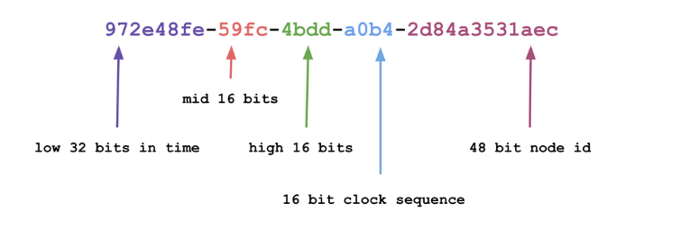
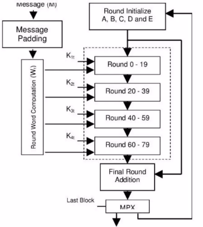

# Universally Unique Identifiers (UUIDs)

    Course Code: ELEE1119 
    
    Course Name: Advanced Computer Engineering

    Credits: 30

    Module Leader: Seb Blair BEng(H) PGCAP MIET MIHEEM FHEA
    
---

## UUIDs

- 32 base 16 characters ([0-9][A-F])

<div align=center>    

$128=32 \cdot log_2(16)$

</div>

- 128 bit numbers



<div align=center>

UUID Version 1 
</div> 

--- 

## UUID Versions

There are 8 versions as of  23 June 2022 

- UUID1 = Timebased + Unique or MAC [no repeats till 3603AD] ​

- UUID2 = Timebased(LSB) + userid​

- UUID3 = Namespace+MD5 hash​

- UUID4 = PRNG [1 trillion UUIDs for a chance of 2 repeats]​

- UUID5 = Namespace + SHA-1 hash​

- UUID6 = Timestamp and monotonic counter.

- UUID7 = UNIX Timestamp

- UUID8 - User defined Data

<!--
(RFC4122 Gregorian calendar no roll overs till 3603)
-->

---

## Who?

- Created by Microsoft but standardised by the **Internet Engineering Task Force** (IETF) and the **International Telecommunication Union** (ITU), so that each user or thing can be uniquely identifiable. 
-  **ITU-T X.667 | ISO/IEC 9834-8**​


    

---

## Where?


<!-- minecraft usese Version 4-->
---


## Combinations: UUID 4 

- $0.0947mm^3$ grain of sand
- UUID4 has 122 random bits, $5.3e36$
- $5.0191e34mm^3 =5.3e36 \cdot 0.0947mm^3$
- Volume of sand as UUID4 = $50,190,000,000,000,008km^3$

...and the volume of Jupiter 

- $1,431,281,810,739,360km^3$


<!--
50 quadrillion, 190 trillion and 8

1 quadrillion 434 trillion 281 billion 810 million 739 thousand and 360
-->

---

## Uniqueness: UUID4

- In the version 4, 6 bits are fixed and the remaining 122 bits are randomly generated, for a total of $2^{122}$ possible UUIDs.
- $n = 2^{122}$
- So if the number of generated UUIDs exceeds $r > n$ then there must be duplicates

- If you assume perfect randomness you would expect to see collison after $2^{61}$
- $2^{58} \approx 24,913,440,000,000,000 =7.2e9\cdot 365 \cdot 24\cdot 60 \cdot 60$
- After a few years you would get the first collisions.

<!--
The first UUID can be any of n possibilities, the second can be any of the n except the first (n-1), the third can be any except for the first two (n-2), and so on.

And the total number of ways to generate r UUIDs is n^r since each of the r UUIDs has n different possibilities. 

24 quadrillion 943 trillion 440 billion 
-->

---

## UUID 1

- combination of:
 
  -  current time and date.
     - RFC 4122 60-bit count of 100$ns$  since  00:00:00:00 15 October 1582 to 01/01/1970 
     - $122192928000000000ns$
     - Current date time since 00:00:00:00 01 January 1970

$1799684520607795200ns = 1677491592607795200  + 122192928000000000$
  -  48-bit MAC address of the host machine

<!--
Gregorian Calendar 15/10/1582

- The Gregorian calendar, also known as the Western calendar, is the most widely used calendar in the world today. Its predecessor, the Julian calendar, was replaced because it did not correctly reflect the actual time it takes the Earth to circle once around the Sun, known as a tropical year.

Unix 01/01/1970

- The year 2038 problem is related to Unix time because times after 03:14:07 UTC on 19 January 2038 will require computers to store the value as greater than 32-bits.
-->
---
## Epochs/Time

- 01/01/1970
  - Unix engineers set the arbitrary datetime stamp because... it was convenient...
-  19/01/2038 03:14:07 the storage for 32-bit will become obsolete, as the value will be too large
   - Will need to migrate to 64-bit or just deal with the timestamp showing:
      - 19/01/1901 03:14:08
  


  <!--

   Years designed as two digits not four.

  In January, a World Bank report estimated that only 21 of 139 developing countries had taken concrete steps to address the year 2000 problem. The report went on to anticipate year 2000 impacts on power, telecommunications, energy, food distribution and medical care in developing countries

   hundreds of billions of dollars spent to kill off the bug worldwide, Y2K ended as mere only glitches.

  -->

---

## UUID 1: Time format
|Name| Bytes|Hex|Bits|Comments|
|---|----|----|----|---|
|time_low|4|8|32|integer giving the low 32-bits of time|
|time_high|2|4|16|integer giving the middle 16-bits of time|
|time_hi_version|2|4|16|4-bits representing the "version" and the followinghigh 12 bits of time|
|clock_seq_hi_and_res clock_seq_low|	2|	4|	16|	1 to 3-bit "variant" in the most significant bits, followed by the 13 to 15-bit clock sequence|

---

## Example
```sh
$ date +"%s.%N" | awk -F "." '{print "(nano seconds = )", (($1*1000000000)+122192928000000000+$2)}'
> (nano seconds = ) 1799602340604762112
```
- Time Low = 04762112 -> 0048AA00
  ```sh
   $ printf "%016X" 04762112 | awk -F "%" '{print $1}'
   > 000000000048AA00
  ```
- Time High = 0fe0 -> 0F29
- Time High+Version = 1179 -> 049B
- Clock_seq = is random bits say a number between 1000-9999 and replace the MSB with the variant number 0x10xx. 
- 0048AA00-0F29-049B-25D9-[MAC|random 48-bits]

 
---
## UUID 2
- Distributed Computing Environment (DCE)
- combination of:
  -  Current time and date.
  -  The local identifier replaces the lower 32 bits of the timestamp.48-bit MAC address of the host machine
       -  Domain Name or Hostname
          ```sh
          $ id -u; id -g; whoami;
          ```
  -  MacAddress or random generated Hex
      ```sh
      cat -A /dev/urandom | less
      ```
---
## UUID 3

- namespace could be website, DNS information, plain text, etc
- the namespace value is hashed using the `md5hash` alogrithm


---


## MD5 Algorithm


---

## MD5 Alogrithm


- Round 1: (b AND c) OR ((NOT b) AND (d))

- Round 2: (b AND d) OR (c AND (NOT d))

- Round 3: b XOR c XOR d

- Round 4: c XOR (b OR (NOT d))

<!--
Each 512-bit block gets broken down further into 16 sub-blocks of 32 bits each. There are four rounds of operations, with each round utilizing all the sub-blocks, the buffers, and a constant array value. 

This constant array can be denoted as T[1] -> T[64].

Each of the sub-blocks are denoted as M[0] -> M[15].
-->
---

## UUID​4


1. Generate 128 random bits:

```sh
dd if=/dev/random count=16 bs=1 2> /dev/null | xxd -ps
> 567D61C2EE3B23914141110256D2385
```

<div align=center>

00000101 01100111 11010110 00011100 00101110 11100011 **10110010** 00111001 **00010100** 00010100 00010001 00010000 00100101 01101101 00100011 10000101 

</div>
    
2. Take the 7th byte and perform an AND operation with `0x0F` to clear out the high nibble. Then, OR it with `0x40` to set the version number to 4.

<div align=center>

00000010  = **10110010** & 00001111​ (0x0f)

01000010  = **00000010** |  01000000 (0x40)

</div>


<!--
Command
- dd == data defintion
arguments 
- if == read from FILE instead of stdin
- count == Copy N blocks
- bs == read/write byes 1 at a time
- 2> errors redirected to blackhole
Command
- xxd == hexdump
  - ps == plain text from beginnning of stream
-->

---

## UUID4 Example 

3. Next, take the 9th byte and perform an AND operation with `0x3F` and then OR it with `0x80`.

<div align=center>

00010100  = **00010100** & 00111111​ (0x3f)

10010100  = **00010100** |  10000000 (0x80)

</div>

4. Convert the 128 bits to hexadecimal representation and insert the hyphens to achieve the canonical text representation.​

<div align=center>

567D61C2-EE30-4299-4141-110256D2385​

</div>

---

## Your Turn

<div align=center>

10101110 00100001 10110100 11111100 01101111 01110010 **10100011** 00110010 **10111010** 10000110 11010010 00001001 11010001 11100000 10101111 01101001 ​

</div>​

2. Take the 7th byte and perform an AND operation with `0x0F` to clear out the high nibble. Then, OR it with `0x40` to set the version number to 4.​

3. Next, take the 9th byte and perform an AND operation with `0x3F` and then OR it with `0x80`.​

4. Convert the 128 bits to hexadecimal representation and insert the hyphens to achieve the canonical text representation.​

<details>
<summary>Answer</summary>

<div align=center>

Before: AE21B4FC-6F72-A332-BA86-D209D1E0AF69

After: AE21B4FC-6F72-**43**32-**BA**86-D209D1E0AF69

</div>
</details>

---

## UUID 5

- namespace could be website, DNS information, plain text, etc
- the namespace value is hashed using the `sha1sum` alogrithm

