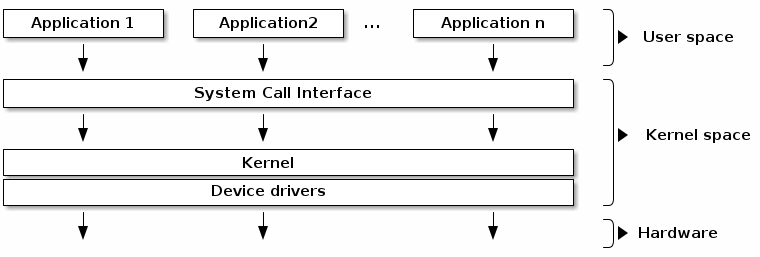
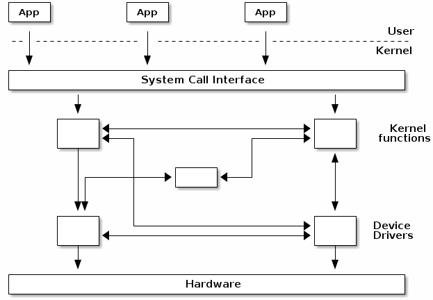
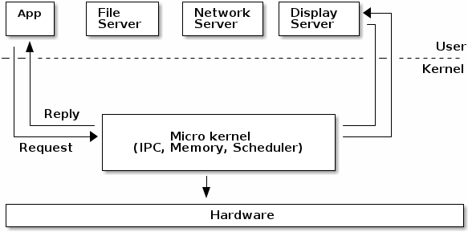
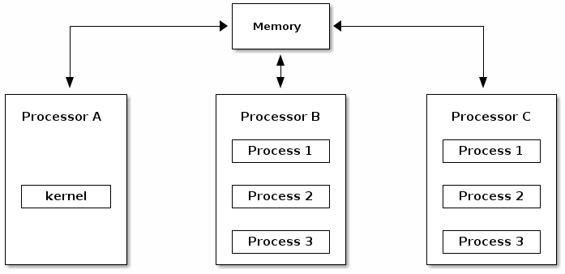
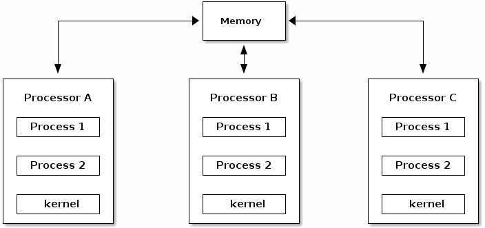
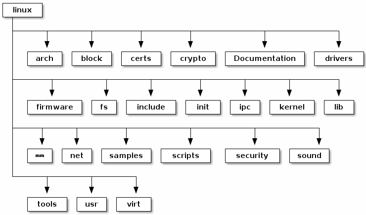
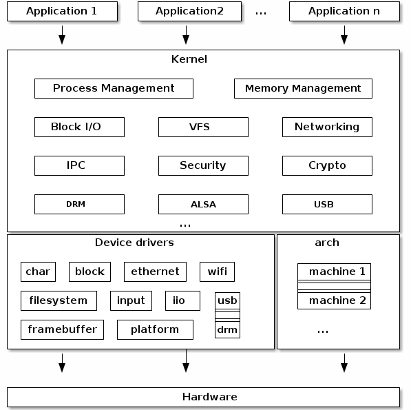

# Kernels and Operating Systems - Linux

    Course Code: ELEE1119 
    
    Course Name: Advanced Computer Engineering

    Credits: 30

    Module Leader: Seb Blair BEng(H) PGCAP MIET MIHEEM FHEA

---
## Kernel


---
## Kernel...

 - The kernel is a busy personal assistant for a powerful executive (the **hardware**). ​

 - It’s the assistant’s job to relay messages and requests (**processes**) from employees and the public (**users**) to the executive. ​

- To remember what is stored where (**memory**).​

 - To determine who has access to the executive at any given time and for how long.​


---

## Kernel is...

If implemented properly the Kernel is invisible to the user, working in its own little world known as the **Kernel Space**. Like where it allocates memory and track of where everything is stored. The **User Space** is the files or applications, what the user sees!

The Kernel is **software​**


---

##


---

## Linux is...

- a kernel developed by Linus Torvald in the 1994 
- it's Free and Open-Source
- monolithic
- modular
- currently at version 5.19 in development

---

## Linux Kernel
<div align=center>

| **Six Major Functions** | **Six Layers**       |
| ----------------------- | -------------------- |
| System                  | Userspace Interfaces |
| Processing              | Virtual              |
| Memory                  | Brdiges              |
| Storage                 | Functional           |
| Networking              | Devices Control      |
| Human interface         | Hardware Interfaces  |

</div>

<!--https://upload.wikimedia.org/wikipedia/commons/5/5b/Linux_kernel_map.png-->

---

## Kernel space and user space

Kernel and user are two terms that are often used in operating systems. 

- The kernel is the part of the operating system that runs with higher privileges$^1$

- while user (space) usually means by applications running with low privileges.


[1]: some processors may have even higher privileges than kernel mode, e.g. a hypervisor mode, that is only accessible to code running in a hypervisor (virtual machine monitor)

<!-- 
For example, local CPU interrupts can only be disabled or enable while running in kernel mode. 

If such an operation is attempted while running in user mode an exception will be generated and the kernel will take over to handle it.
-->

---

## Kernel space and user space

User space and kernel space may refer specifically to **memory protection** or to **virtual address spaces** associated with either the kernel or user applications.

- The kernel space is the **memory area** that is reserved to the kernel while user space is the memory area reserved to a particular user process. 

- The kernel space is access protected so that user applications can not access it directly, while user space can be directly accessed from code running in kernel mode.

---

##  Typical operating system architecture

In the typical operating system architecture (see the figure below) the operating system kernel is responsible for access and sharing the hardware in a secure and fair manner with multiple applications.



---

## Kernel API


The kernel offers a set of ***Application Programming Interface*** (APIs) that applications issue which are generally referred to as **System Calls**. These APIs are different from regular library APIs because they are the boundary at which the execution mode **switch** from **user mode** to **kernel mode**.

In order to provide application compatibility, system calls are rarely changed. Linux particularly enforces this (as opposed to in kernel APIs that can change as needed).

---

## Kernel Code

The kernel code itself can be logically separated in core kernel code and device drivers code. 

Device drivers code is responsible of accessing particular devices while the core kernel code is generic. 

The core kernel can be further divided into multiple logical subsystems (e.g. file access, networking, process management, etc.)


---

## Linux Kernel Code

[https://github.com/torvalds/linux](https://github.com/torvalds/linux)


**initramfs_data.S** [assembler source file]

```S
.section .init.ramfs,"a"
__irf_start:
.incbin "usr/initramfs_inc_data"
__irf_end:
.section .init.ramfs.info,"a"
.globl __initramfs_size
__initramfs_size:
#ifdef CONFIG_64BIT
	.quad __irf_end - __irf_start
#else
	.long __irf_end - __irf_start
#endif
```

---

## Monolithic Kernel

There is no access protection between the various kernel subsystems and where public functions can be directly called between various subsystems.



<!-- 

However, most monolithic kernels do enforce a logical separation between subsystems especially between the core kernel and device drivers with relatively strict APIs (but not necessarily fixed in stone) that must be used to access services offered by one subsystem or device drivers. 

This, of course, depends on the particular kernel implementation and the kernel's architecture
-->

---

## Micro-kernel

Large parts of the kernel are protected from each-other, usually running as services in user space. Because significant parts of the kernel are now running in user mode, the remaining code that runs in kernel mode is significantly smaller, hence micro-kernel term.



<!--
This architecture imposes a modular approach to the kernel and offers memory protection between services but at a cost of performance.

What is a simple function call between two services on monolithic kernels now requires going through IPC and scheduling which will incur a performance penalty

-->

---

## Micro-kernels vs monolithic kernels

Monolithic kernels can also be modular and there are several approaches that modern monolithic kernels use toward this goal:

 - Components can enabled or disabled at compile time
 - Support of loadable kernel modules (at runtime)
 - Organize the kernel in logical, independent subsystems
 - Strict interfaces but with low performance overhead: macros, inline functions, function pointers

There is a class of operating systems that (used to) claim to be hybrid kernels, in between monolithic and micro-kernels (e.g. Windows, Mac OS X). However, since all of the typical monolithic services run in kernel-mode in these operating systems, there is little merit to qualify them other than monolithic kernels.

---

##  Address Space

The address space term is an overload term that can have different meanings in different contexts.

 - The physical address space refers to the way the RAM and device memories are visible on the memory bus.

 - The physical address space refers to the way the RAM and device memories are visible on the memory bus. 
   - process (address) space [the "memory view" of processes. It is a continuous area that starts at zero]
   - kernel (address) space.


<!--

The kernel is responsible of setting up a mapping that creates a virtual address space in which areas of this space are mapped to certain physical memory areas. 

-->
---

## User and kernel sharing the virtual address space

A typical implementation for user and kernel spaces is one where the virtual address space is shared between user processes and the kernel.


<!--
In this case kernel space is located at the top of the address space, while user space at the bottom. 

In order to prevent the user processes from accessing kernel space, the kernel creates mappings that prevent access to the kernel space from user mode.
-->

---

## Asymmetric MultiProcessing (ASMP)

 - the kernel throughput (e.g. system calls, interrupt handling, etc.) does not scale with the number of processors and hence typical processes frequently use system calls. 
 - The scalability of the approach is limited to very specific systems 




<!--

Supports multiple processors (cores), where a processor is dedicated to the kernel and all other processors run user space programs.

-->

--- 

## Symmetric MultiProcessing (SMP)

Runs on any of the existing processors, just as user processes. This approach is more difficult to implement, because it creates race conditions in the kernel if two processes run kernel functions that access the same memory locations.

In order to support SMP the kernel must implement synchronization primitives (e.g. spin locks) to guarantee that only one processor is executing a critical section.



<!--

https://github.com/torvalds/linux/blob/master/kernel/smp.c

-->

---

## Overview of Linux Kernel
### Linux Development Model

- The Linux kernel is one the largest open source projects in the world with thousands of developers contributing code and millions of lines of code changed for each release.

- It is distributed under the GPLv2 license.

- Releases at fixed intervals of time (usually 3 - 4 months)
  
- Merge windows two weeks

---

## Overview of Linux Kernel
### Maintainer Heirarchy

In order to scale the development process, Linux uses a hierarchical maintainership model:

 - Linus Torvalds is the maintainer of the Linux kernel and merges pull requests from subsystem maintainers

Each maintainer has its own git tree, e.g.:
 - Linux Torvalds: git://git.kernel.org/pub/scm/linux/kernel/git/torvalds/linux-2.6.git
 - David Miller (networking): git://git.kernel.org/pub/scm/linux/kernel/git/davem/net.git/

Each subsystem may maintain a -next tree where developers can submit patches for the next merge window

--- 

## Overview of Linux Kernel
### Linux source code layout




<!--
arch - contains architecture specific code; each architecture is implemented in a specific sub-folder (e.g. arm, arm64, x86)

block - contains the block subsystem code that deals with reading and writing data from block devices: creating block I/O requests, scheduling them (there are several I/O schedulers available), merging requests, and passing them down through the I/O stack to the block device drivers

certs - implements support for signature checking using certificates

crypto - software implementation of various cryptography algorithms as well as a framework that allows offloading such algorithms in hardware

Documentation - documentation for various subsystems, Linux kernel command line options, description for sysfs files and format, device tree bindings (supported device tree nodes and format)

drivers - driver for various devices as well as the Linux driver model implementation (an abstraction that describes drivers, devices buses and the way they are connected)

firmware - binary or hex firmware files that are used by various device drivers

fs - home of the Virtual Filesystem Switch (generic filesystem code) and of various filesystem drivers

include - header files

init - the generic (as opposed to architecture specific) initialization code that runs during boot

ipc - implementation for various Inter Process Communication system calls such as message queue, semaphores, shared memory

kernel - process management code (including support for kernel thread, workqueues), scheduler, tracing, time management, generic irq code, locking

lib - various generic functions such as sorting, checksums, compression and decompression, bitmap manipulation, etc.

mm - memory management code, for both physical and virtual memory, including the page, SL*B and CMA allocators, swapping, virtual memory mapping, process address space manipulation, etc.

net - implementation for various network stacks including IPv4 and IPv6; BSD socket implementation, routing, filtering, packet scheduling, bridging, etc.

samples - various driver samples

scripts - parts the build system, scripts used for building modules, kconfig the Linux kernel configurator, as well as various other scripts (e.g. checkpatch.pl that checks if a patch is conform with the Linux kernel coding style)

security - home of the Linux Security Module framework that allows extending the default (Unix) security model as well as implementation for multiple such extensions such as SELinux, smack, apparmor, tomoyo, etc.

sound - home of ALSA (Advanced Linux Sound System) as well as the old Linux sound framework (OSS)

tools - various user space tools for testing or interacting with Linux kernel subsystems

usr - support for embedding an initrd file in the kernel image

virt - home of the KVM (Kernel Virtual Machine) hypervisor
-->
---

### Linux kernel architecture




---
<div align=center>
We are now going to explore a linux system. 
</div>
